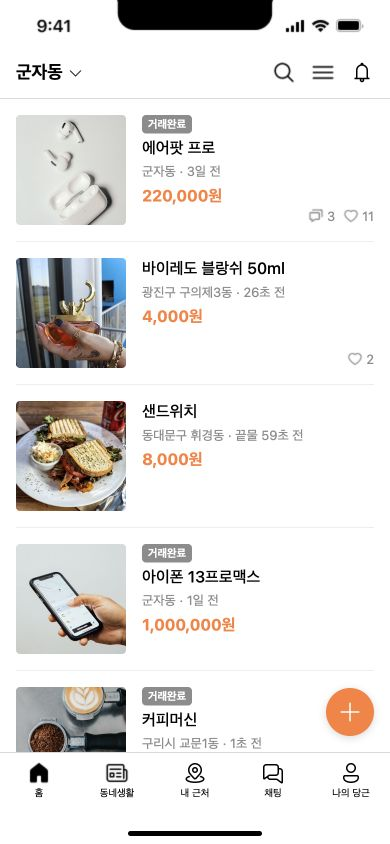
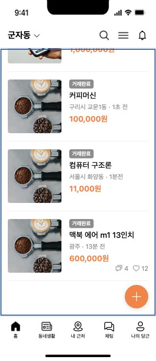

# KUIT 8기 웹 2주차 정일혁

리액트 빠른 시작 실습과 당근마켓 홈 화면 미션입니다. 실습과 미션 구현, 컴포넌트 분리, 스타일 및 검증 기록을 각각 커밋했습니다.

## 실행

```bash
npm ci
npm run dev
npm run lint
npm run build
npm run preview
```

| 주소 | 내용 | 진입점 |
| --- | --- | --- |
| `/` | 당근마켓 홈 화면 미션 | `src/main.jsx` → `src/App.jsx` |
| `/practice.html` | 리액트 빠른 시작 실습 | `src/practice/main.jsx` → `src/practice/PracticeApp.jsx` |

실습과 미션은 별도 HTML 진입점과 CSS를 사용합니다. 두 페이지 모두 프로덕션 빌드에 포함됩니다.

## 실습

[리액트 공식 빠른 시작](https://ko.react.dev/learn)의 조건부 렌더링까지 실행 예제로 정리했습니다.

| 내용 | 구현 위치 |
| --- | --- |
| 컴포넌트 생성과 중첩 | `src/practice/components/Greeting.jsx` |
| JSX와 Fragment | `src/practice/components/JsxRules.jsx` |
| className과 스타일 | `src/practice/components/ProfileCard.jsx`, `src/practice/practice.css` |
| 데이터와 표현식 표시 | `src/practice/components/StudyInfo.jsx` |
| if, 삼항 연산자, && | `src/practice/components/AttendanceBadge.jsx`, `src/practice/components/AttendancePanel.jsx` |

출석 체크박스와 공지 버튼으로 조건의 참·거짓 결과를 비교할 수 있습니다. 두 상태를 직접 확인하려고 이 부분에만 다음 단계의 `useState`를 사용했습니다.

## 미션

1단계에서는 모든 미션 JSX를 `App.jsx`에 작성했습니다. 2단계에서는 같은 화면을 아래 컴포넌트로 분리했습니다. 분리 직후에는 SSR 결과 HTML 5,607자가 이전 단계와 동일함을 확인했습니다. 3단계에서는 조건부 렌더링·props 전달을 검증하고 좁은 화면과 키보드 스크롤을 보완했습니다.

| 컴포넌트 | props | 역할 |
| --- | --- | --- |
| `App` | 없음 | 모델을 한 번 가져와 `location`, `items`를 비구조화하고 전달 |
| `Header` | `location` | 현재 동네와 검색·메뉴·알림 아이콘 |
| `Content` | `items` | `map`으로 상품 목록 생성, `item.id`를 key로 사용 |
| `ItemCard` | `item` | 상품 데이터를 비구조화해 사진·제목·동네·시간·가격 표시 |
| `BottomNav` | 없음 | 하단 메뉴 다섯 개와 현재 홈 위치 표시 |

`isSold`가 참인 상품에만 거래완료 배지가 표시됩니다. 댓글·관심 수는 `> 0`으로 검사해 숫자 0이 화면에 남지 않게 했습니다.

390×844 시안의 헤더, 110px 상품 사진, 하단 메뉴, 글쓰기 버튼을 구현했습니다. 320px 화면에서도 가로 넘침 없이 표시되며, 상품 목록에 키보드 초점을 두고 Home·End·방향키로 스크롤할 수 있습니다. 마지막 상품은 글쓰기 버튼과 하단 메뉴에 가리지 않도록 여백을 뒀습니다.

검색·알림·탭 이동·글쓰기의 실제 서비스 동작은 이번 화면 구현 과제에 포함되지 않아 해당 버튼은 비활성 상태입니다.

## 데이터와 자산

제공된 `week2/minseo/src/model.js/marketModel.js`의 상품 일곱 개를 사용했습니다. 원본 값은 유지하고 사진 경로와 안정적인 key용 `id`만 추가했습니다. App 이외의 컴포넌트는 모델을 직접 가져오지 않습니다.

원본 데이터에서 마지막 두 상품은 커피머신과 같은 사진 경로를 사용하므로 이 구현도 동일하게 재사용합니다.

사진과 아이콘 18개는 [당근마켓_1 Figma 원본](https://www.figma.com/design/4nvJv24TnSWljlAK79qXgd/당근마켓?node-id=102-83)에서 내보냈습니다. `public/assets`에는 다운로드한 원본 파일과 프레임 SVG에 포함된 이미지의 원본 바이트를 저장했습니다. 외부 임시 URL이나 직접 그린 대체 아이콘은 사용하지 않습니다.

## 검증

2026-09-22, Node v25.6.1 / npm 11.9.0 / Chrome에서 확인했습니다.

- `npm run lint`, `npm run build` 통과.
- 원본 모델과 값 일치, 상품 7개·거래완료 5개·댓글 표시 2개·관심 표시 3개 확인.
- 임의의 상품 props와 빈 배열을 렌더링해 전달된 데이터, 판매 상태, 0/양수 반응의 분기 확인.
- 실습 체크박스와 공지 버튼을 마우스 및 Space·Enter로 변경하고 양쪽 상태 확인.
- 320px·390px·데스크톱에서 이미지 로딩과 레이아웃 확인. 320px에서 문서와 화면 너비 모두 320px이며, End 키로 마지막 상품까지 이동 가능.
- 원본 자산 18개 로드, 브라우저 경고·오류 없음.




