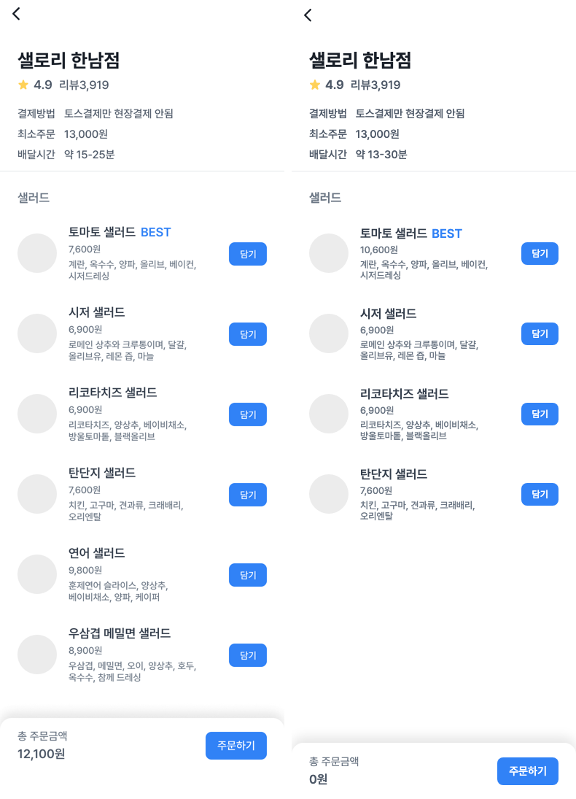
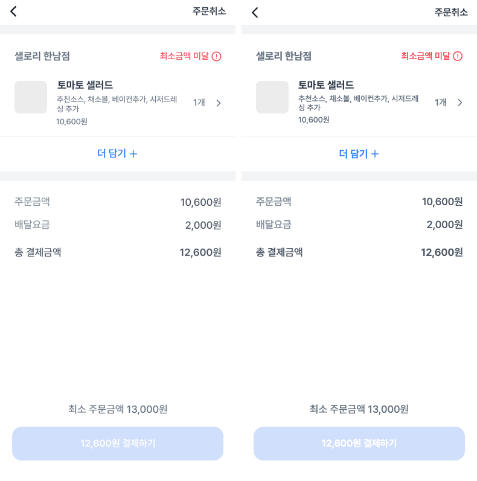
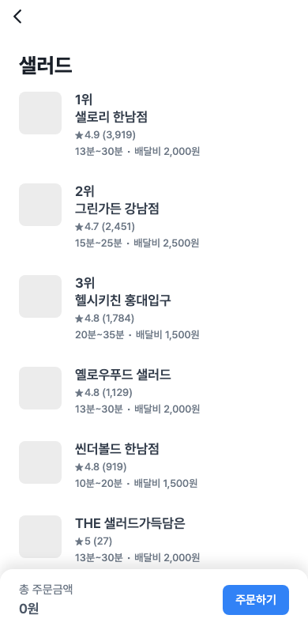

# KUIT 8기 웹 3주차 정일혁

컴포넌트 설계와 스타일링 주차의 실습(Stores 화면)과 미션(Store·Cart 화면)입니다. 실습과 미션은 커밋 메시지의 `3주차 실습`, `3주차 미션`으로 나눴습니다.

## 실행

```bash
npm ci
npm run dev
npm run lint
npm run build
```

| 주소 | 화면 | 구분 |
| --- | --- | --- |
| `/store` | 가게 목록 | 실습 |
| `/store/1` ~ `/store/6` | 가게 상세. 메뉴 데이터는 1~3번 가게에만 있습니다 | 미션 |
| `/cart` | 장바구니 | 미션 |

제공된 `Router`에는 `/` 경로가 없어서 `/`로 들어가면 React Router의 404 화면이 뜹니다. 라우팅은 이번 주 범위가 아니라 제공 코드를 그대로 두었고, 개발 서버를 켠 뒤 `/store`로 들어가면 됩니다.

## 실습

[실습 영상](https://youtu.be/SPVTByc6a2Q)의 순서대로 커밋했습니다.

| 커밋 | 내용 |
| --- | --- |
| `chore: 3주차 실습 Vite 프로젝트와 제공 코드 준비` | `npm create vite`로 만든 React 프로젝트에 `week3/mission`의 더미 데이터, `BackBar`·`Button`·`OrderBar`, `Router`와 자리 페이지, 아이콘을 가져왔습니다. `mission` 폴더는 건드리지 않았습니다. |
| `feat: 3주차 실습 Tailwind CSS와 Pretendard 설정` | `tailwindcss`·`@tailwindcss/vite`를 Vite 플러그인으로 등록하고, Pretendard를 불러와 최상위 요소에 폰트와 기본 줄 높이를 적용했습니다. |
| `feat: 3주차 실습 Stores 화면 구조와 가게 한 칸 정적 구현` | 고정된 상단 바(41px)와 하단 바(77px)만큼 위아래 여백을 두고, 첫 번째 가게 한 칸을 값 그대로 붙였습니다. |
| `feat: 3주차 실습 가게 목록을 stores 데이터 map 으로 렌더링` | `map`과 구조 분해로 가게 여섯 칸을 그리고, 1~3위에만 순위를 붙였습니다. 리뷰 수와 배달비에는 천 단위 쉼표를 넣었습니다. |

## 미션

스타일링은 제공된 Stores 화면과 같은 Tailwind CSS로 통일했습니다. 한 프로젝트 안에서 방식을 섞지 않기 위해서입니다.

```text
Stores (/store)
├─ BackBar
├─ StoreList ─ StoreItem × 6 ─ Thumbnail
└─ OrderBar ─ Button

Store (/store/:storeId)
├─ BackBar
├─ StoreInfo
├─ MenuSection ─ MenuItem × N ─ Thumbnail, Button
└─ OrderBar ─ Button

Cart (/cart)
├─ BackBar (주문취소)
├─ CartStoreHeader
├─ CartItem × N ─ Thumbnail
├─ AddMoreButton
├─ PriceSummary ─ PriceRow × 3
└─ PaymentBar ─ Button
```

### 설계하면서 정한 것

- 세 화면의 리스트 한 칸(가게, 메뉴, 장바구니 메뉴)은 하나로 합치지 않았습니다. 가게 한 칸은 순위·별점·배달 정보를, 메뉴 한 칸은 BEST·재료·담기 버튼을, 장바구니 한 칸은 옵션·수량을 보여 주고 쓰임도 다릅니다. 하나로 합치면 화면마다 켜고 끄는 props가 늘어납니다. 세 줄이 똑같이 쓰는 54px 이미지 자리만 `Thumbnail`(모양은 `shape` props)로 뺐습니다.
- 실습의 `StoreItem`은 이름과 달리 배열을 받아 목록 전체를 그렸습니다. 반복과 순위 규칙은 `StoreList`가, 가게 한 칸은 `StoreItem`이 맡도록 나눴습니다.
- `Button`은 크기별 모서리와 굵기를 `size`에 함께 넣었습니다. 결제하기 버튼(`xl`)은 16px 모서리와 350px 고정 폭입니다. 넘긴 `className`은 기본 스타일 뒤에 붙습니다.
- 장바구니 더미 데이터(`src/models/cart.js`)에는 담긴 메뉴의 id·수량·옵션만 적었습니다. 주문금액, 총 결제금액, 최소주문 미달 여부는 가게 데이터와 담긴 메뉴에서 계산하므로 따로 저장하지 않습니다. 계산 결과(10,600원 + 배달 2,000원 = 12,600원, 최소주문 13,000원 미달)는 시안과 같습니다.
- Store 화면은 주소의 `storeId`로 가게를 찾습니다. 주소 값은 문자열이라 `Number`로 바꿔 비교합니다. 없는 id는 안내 문구를, 메뉴 데이터가 없는 4~6번 가게는 빈 목록을 보여 줍니다.
- 데이터에 없는 결제방법은 시안 문구를 페이지에서 넘깁니다. 배달시간은 데이터 값을 씁니다(시안 15-25분, 1번 가게 데이터 13-30분).
- 담기·주문하기 버튼 동작과 장바구니 상태는 이후 주차 범위라 구현하지 않았습니다. 그래서 하단 주문 바의 금액은 0원입니다.

## 시안 대조

피그마 렌더(REST API)를 1배로 줄이고 상태 바(47px)와 홈 인디케이터를 잘라 390px 헤드리스 크롬 캡처와 나란히 놓았습니다. 왼쪽이 시안, 오른쪽이 구현입니다. 메뉴 개수와 가격이 다른 것은 시안이 아니라 `stores.js` 데이터를 썼기 때문입니다.





크롬은 13px Pretendard의 기본 줄 높이를 15px로 반올림합니다(피그마는 15.51px). 그래서 글자 묶음 높이로 줄 높이를 만들면 110px 줄이 107px이 됩니다. 메뉴·장바구니 줄은 높이를 110px로 고정했습니다.



## 아이콘

`arrow.svg`, `graystar.svg`는 제공된 파일입니다. `star.svg`(별점), `warning.svg`(최소금액 미달), `chevron-right.svg`(장바구니 메뉴), `plus.svg`(더 담기)는 [미션 피그마](https://www.figma.com/file/QhVCiiDIEn0l1UtaU4ELxU/2022tosspdchallenge_asset)의 해당 노드를 SVG로 내보낸 원본입니다.
